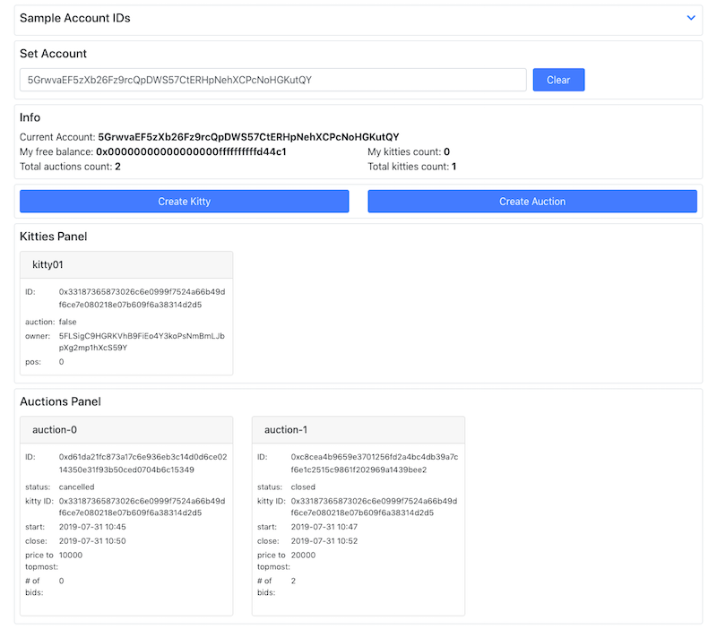

# Parity HA Frontend

- [Demo site](https://kittyauction.dapp.hkwtf.com/)
- [Video demo](https://youtu.be/Ru7_BeX1a1g)
- [Substrate Runtime code repository](https://github.com/jimmychu0807/parity-ha-runtime)
- [React frontend code repository](https://github.com/jimmychu0807/parity-ha-ui)

### Overall

This is the React frontend that works with the [Substrate Blockchain Runtime](https://github.com/jimmychu0807/parity-ha-runtime), and is bootstrapped with [Create React App](https://github.com/facebook/create-react-app).

### Implementation Notes

  - Mainly relied on awesome UI libraries [Bootstrap](https://getbootstrap.com/) and [Fontawesome](https://fontawesome.com/).
  - All Substrate interactions are handled in [substrateService](./src/services/substrateService.js), using [Polkadot-js API](https://polkadot.js.org/api/).

### Deployment Notes

  - There is a build and deployment script within `bin` folder.
  - A `.env` is needed to build the project properly. Please refer to the [template file](./.env.template).
